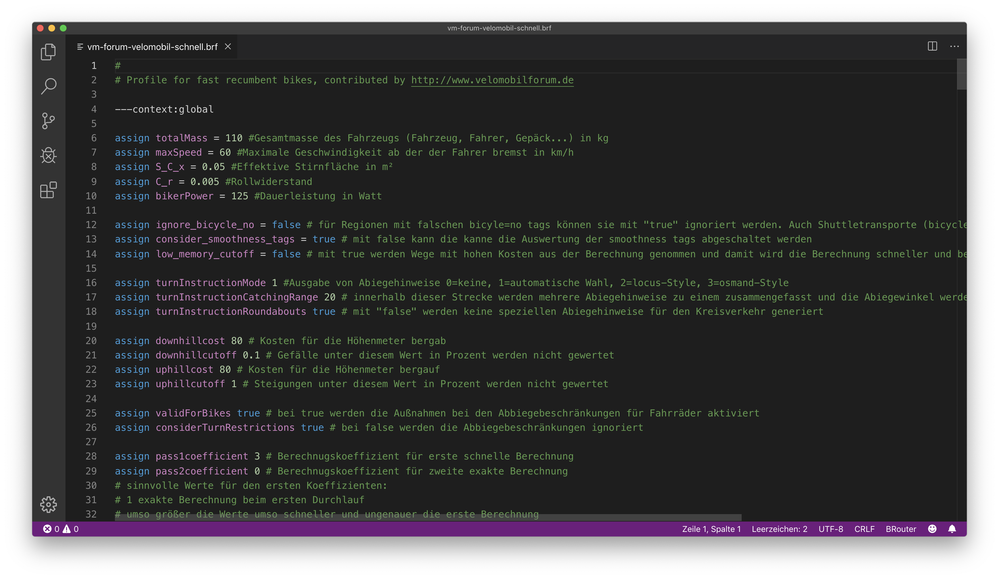

# BRouter Syntax Highlighting

The extension BRouter is used for syntax highlighting of the profile files (*brf) of the Bike Routing Software.

[BRouter](https://brouter.de/brouter/index.html)  
[BRouter-Web](https://brouter.de/brouter-web/)

---

## Features

Syntax highligthing support for BRouter profile files generated with [Iro](https://eeyo.io/iro/)

---

## Install

See the [extension installation guide](https://code.visualstudio.com/docs/editor/extension-gallery) for details.

---

## Known Issues

The prevention of wrong marking for words that are both tag and value does not work yet.

---

## Release Notes

### 1.0.0

Initial release

